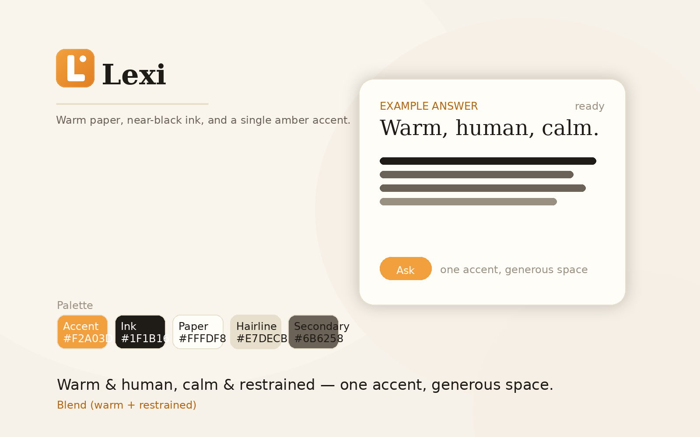
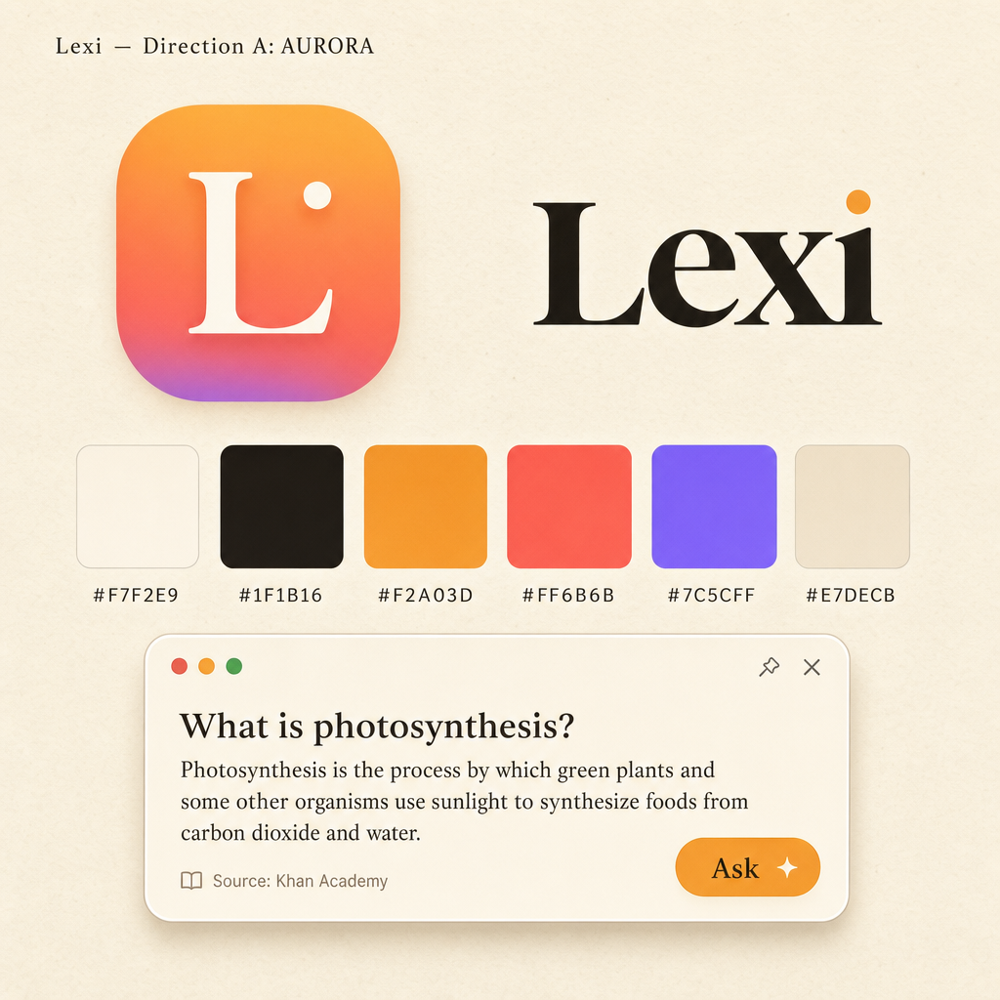
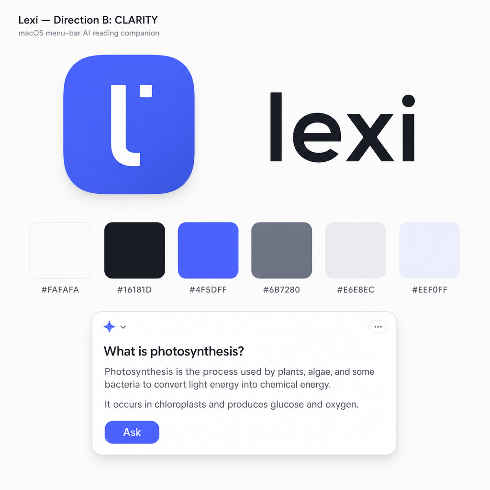

# Lexi Brand Guide

Lexi's visual identity and design system. This is the **foundation** that every
Lexi surface adopts — the menu-bar item, first-run onboarding, Settings, and the
floating answer panel. It exists as self-contained files so it can be adopted
incrementally without rewriting existing screens:

- **Theme / tokens** — [`Sources/Lexi/DesignSystem/LexiTheme.swift`](../Sources/Lexi/DesignSystem/LexiTheme.swift)
- **Wordmark & brand mark** — [`Sources/Lexi/DesignSystem/LexiWordmark.swift`](../Sources/Lexi/DesignSystem/LexiWordmark.swift)
- **App icon generator** — [`scripts/generate_app_icon.py`](../scripts/generate_app_icon.py) → `assets/AppIcon.iconset/*` → `assets/Lexi.icns`

> **Status colors are unchanged.** The semantic system colors used across the app
> (green / blue / orange / purple / red) keep working exactly as before. The
> brand accent is *additive* — for selection, emphasis, links and glow — and is
> never a substitute for status meaning. `LexiTheme.Status` provides friendly
> aliases (`.success`, `.info`, `.warning`, `.error`, `.special`) that map onto
> those same system colors.

---

## 1. Research & rationale

We studied two reference products and translated what makes each feel like a
finished, human product (rather than a developer settings panel) into native
macOS design decisions.

### Poke — https://poke.com/
- **Warmth via "paper."** Soft cream, paper-textured backgrounds; sky→sand
  gradients. The page feels analog and inviting, not clinical.
- **Literary serif headlines.** Display copy is set in an elegant serif,
  giving a human, editorial voice.
- **Conversational microcopy.** Warm, first-person, a little cheeky.
- **Restrained accents.** Dark-ink pill buttons; blue reserved for links. Color
  comes from imagery, not loud UI chrome.
- **A friendly mark.** A simple glyph in a dark badge — memorable, not corporate.

### Devin — https://app.devin.ai and https://devin.ai
- **Calm and confident.** Near-white canvas, generous whitespace, a clean
  geometric sans, near-black ink.
- **One restrained accent.** A single blue for emphasis and links; greys do the
  structural work. Status colors appear only in product data.
- **Quiet structure.** Thin hairlines, soft shadows, calm rhythm — the product
  feels premium because it is *restrained*.

### Synthesis → Lexi
Lexi is a **friendly, magical reading companion**. It should feel *warm and
human* while staying *calm and native*. We take:
- warm paper surfaces, serif voice, and conversational tone;
- whitespace, hierarchy, and a single confident accent;
- and keep everything native macOS — SF fonts (including SF Serif, which is
  built in), vibrancy materials, continuous-corner squircles, SF Symbols.

### Mockup: final direction

| Final — Blend (warm + restrained) |
| --- |
|  |

### Directions originally considered

| A — Aurora | B — Clarity |
| --- | --- |
|  |  |

---

## 2. The two directions considered

### Direction A — **Aurora**
Warm, characterful, Poke-leaning. Cream "paper" surfaces, warm ink text, a
single warm accent, and a **SF Serif** wordmark. Personality: warm, witty,
encouraging — a clever friend who loves explaining things.

- **Pros:** Distinctive and memorable; feels like a product with a soul; the
  serif wordmark and warm palette give instant brand recognition.
- **Cons / risk:** Warmth must stay disciplined so it reads native, not ornate.

### Direction B — **Clarity**
Calm, minimal, Devin-leaning. Near-white/graphite surfaces, a restrained single
accent, a geometric lowercase **SF** wordmark, lots of whitespace. Personality:
precise, quiet, premium.

- **Pros:** Very safe and clean; trivially accessible contrast; minimal risk.
- **Cons:** Closer to the "settings-panel" energy we're trying to escape; less
  distinctive.

### Decision
**We blended them.** The final direction keeps Aurora's warmth — warm cream
paper, warm near-black ink, serif warmth in the wordmark and headline voice —
and applies Clarity's restraint — one warm accent only, generous whitespace,
minimal simultaneous colors, restrained shadows/glows, and a refined, not
decorative, wordmark.

Think of the result as **warm + restrained**:
- one accent, used sparingly;
- warm neutrals doing the heavy lifting;
- high whitespace and calm hierarchy;
- subtle depth, never glossy or loud.

---

## 3. Palette

All colors resolve to dynamic light/dark values in `LexiTheme.swift`.

### Brand accent (single, warm)
- `Color.lexiAccent` — `#F2A03D` / `#FFB45C`
- `Color.lexiAccentText` — `#B5650C` / `#FFC988` for AA-friendly accent text,
  links and small emphasis on paper
- `Color.lexiAccentWash` — `Color.lexiAccent.opacity(0.12)` for selection,
  highlights and subtle tinting
- `Color.lexiAccentDeep` — `#E07F22` / `#E89A45` for the **app icon gradient
  end only**
- `LinearGradient.lexiWarm` — marigold → amber, one hue family only

> In UI chrome, prefer the **solid** `Color.lexiAccent` over gradients. The
> gradient is reserved for the icon and other brand-mark moments.

### Surfaces (warm paper)
- `Color.lexiPaper` — `#F7F2E9` / `#1A1714`
- `Color.lexiPaperElevated` — `#FFFDF8` / `#241F1A`
- `Color.lexiPaperSunken` — `#EFE8D9` / `#141110`

### Ink (text) & lines
- `Color.lexiInk` — `#1F1B16` / `#F3EEE6`
- `Color.lexiInkSecondary` — `#6B6258` / `#B8AE9F`
- `Color.lexiInkTertiary` — `#9A9082` / `#847A6C`
- `Color.lexiHairline` — `#E7DECB` / `#3A332B`

### Status (unchanged semantics)
- success = green
- info = blue
- warning = orange
- error = red
- special = purple

### Why these tokens exist
- `lexiPaper*` keeps every surface on the same warm paper family.
- `lexiInk*` gives a consistent editorial hierarchy for text.
- `lexiHairline` provides calm structural separation without hard borders.
- `lexiAccent*` gives one warm accent for emphasis, not a rainbow of chrome.

---

## 4. Typography

Lexi's type stack is deliberately simple:

- **Display / brand voice:** `Font.lexiDisplay` uses **SF Serif** and is now
  `.semibold` by default for a calmer, more refined feel.
- **Titles:** SF Rounded (`.lexiTitle`, `.lexiHeadline`, `.lexiSubheadline`) for
  native, approachable structure.
- **Body:** SF Pro (`.lexiBody`, `.lexiCaption`, etc.) for readability and
  system consistency.

### Brand-display usage
```swift
Text("Lexi")
    .font(.lexiDisplay(36))
    .foregroundStyle(Color.lexiInk)
```

### Heading hierarchy
```swift
VStack(alignment: .leading, spacing: LexiTheme.Spacing.sm) {
    Text("How Lexi works")
        .font(.lexiTitle)
    Text("Warm, human, and calm.")
        .font(.lexiBody)
        .foregroundStyle(Color.lexiInkSecondary)
}
```

---

## 5. Spacing, radius, materials, motion

### Spacing
An 8pt-based rhythm — use these instead of magic numbers:
- `LexiTheme.Spacing.xxs = 2`
- `LexiTheme.Spacing.xs = 4`
- `LexiTheme.Spacing.sm = 8`
- `LexiTheme.Spacing.md = 12`
- `LexiTheme.Spacing.lg = 16`
- `LexiTheme.Spacing.xl = 24`
- `LexiTheme.Spacing.xxl = 32`
- `LexiTheme.Spacing.xxxl = 48`

### Radius
Use continuous corners and keep the range small and familiar:
- `LexiTheme.Radius.xs = 6`
- `LexiTheme.Radius.sm = 10`
- `LexiTheme.Radius.md = 14`
- `LexiTheme.Radius.lg = 20`
- `LexiTheme.Radius.xl = 28`
- `LexiTheme.Radius.pill = 999`

### Materials
- `LexiTheme.Material.panel` for the floating answer panel / overlay.
- `LexiTheme.Material.card` for inline cards in Settings and similar surfaces.

### Restraint principles
- generous whitespace before decoration;
- one accent, not many;
- minimal simultaneous colors in a single surface;
- subtle shadows and glows;
- no ornamental flourishes unless they carry meaning.

### Motion
Keep motion quiet and physically plausible:
- spring transitions should feel quick and soft, not bouncy;
- glows should be rare and subtle;
- avoid stacked effects (glow + heavy shadow + multiple gradients) on the same
  element.

---

## 6. Logo usage

Lexi has two brand assets that work together:

- **`LexiMark` / `LexiBrandMark`** — the rounded monogram badge.
- **`LexiWordmark`** — the serif "Lexi" wordmark.

### Brand mark
- The badge fills with `LinearGradient.lexiWarm`.
- The wordmark has **no decorative dot** — it is plain serif ink.
- The glow is **off by default** (`LexiBrandMark(size: ..., glow: false)`).
- Use glow only for a hero focal moment, never in dense UI chrome.

### Wordmark
```swift
LexiWordmark(size: 28)
```

Use the wordmark in product headers (Settings, onboarding) and the About
surface. Keep it on calm paper backgrounds; never place it over busy imagery.

### Prefer this
- solid accent fills in buttons and pills;
- warm paper surfaces;
- a single warm accent touch when the brand mark is present.

### Avoid this
- decorative accent dots in the wordmark;
- multiple competing gradients in a single surface;
- strong glows in ordinary controls.

---

## 7. Per-surface adoption checklist

Use these as copy-paste starting points for the three main sessions/surfaces.
The goal is to converge on the same visual language everywhere without forcing a
big-bang rewrite.

### Session A — Menu bar (`AppDelegate.swift`) & Onboarding

Menu-bar item:
```swift
item.button?.image = LexiBrand.statusItemImage()
```

Onboarding header:
```swift
VStack(alignment: .leading, spacing: LexiTheme.Spacing.md) {
    LexiWordmark(size: 32, layout: .badgeAndWordmark)

    Text("Your friendly reading companion.")
        .font(.lexiBody)
        .foregroundStyle(Color.lexiInkSecondary)
}
.padding(LexiTheme.Spacing.xl)
.background(Color.lexiPaper)
```

Primary action button:
```swift
Button("Get started") { … }
    .buttonStyle(.lexiPrimary)
```

### Session B — Settings (`SettingsWindowController.swift`)

Header (replaces the `Image(systemName: "textformat")` + title block):
```swift
HStack(spacing: LexiTheme.Spacing.md) {
    LexiBrandMark(size: 44)
    VStack(alignment: .leading, spacing: LexiTheme.Spacing.xs) {
        LexiWordmark(size: 24)
        Text("Tune how Lexi reads alongside you.")
            .font(.lexiSubheadline)
            .foregroundStyle(Color.lexiInkSecondary)
    }
}
```

Section card + accent-tinted controls:
```swift
VStack(alignment: .leading, spacing: LexiTheme.Spacing.md) {
    Text("Shortcuts").font(.lexiHeadline)
    // …rows…
}
.lexiCard()

Toggle("Read answers aloud", isOn: $isReadAloudEnabled)
    .lexiAccented()
```

Status row colors stay semantic:
```swift
Image(systemName: status.isGranted ? "checkmark.circle.fill" : "exclamationmark.triangle.fill")
    .foregroundStyle(status.isGranted ? LexiTheme.Status.success : LexiTheme.Status.warning)
```

### Session C — Answer panel (`RawCapturePanelController.swift`)

Panel surface + title:
```swift
VStack(alignment: .leading, spacing: LexiTheme.Spacing.md) {
    Text(term)
        .font(.lexiDisplay(20))
        .foregroundStyle(Color.lexiInk)
    Text(answer)
        .font(.lexiBody)
        .foregroundStyle(Color.lexiInk)
}
.padding(LexiTheme.Spacing.lg)
.background(LexiTheme.Material.panel, in: RoundedRectangle(cornerRadius: LexiTheme.Radius.xl, style: .continuous))
.overlay(
    RoundedRectangle(cornerRadius: LexiTheme.Radius.xl, style: .continuous)
        .strokeBorder(Color.lexiHairline, lineWidth: LexiTheme.hairline)
)
```

Selection / nested-lookup highlight:
```swift
.background(Color.lexiAccentWash, in: RoundedRectangle(cornerRadius: LexiTheme.Radius.sm, style: .continuous))
.overlay(
    RoundedRectangle(cornerRadius: LexiTheme.Radius.sm, style: .continuous)
        .strokeBorder(Color.lexiAccent.opacity(0.45), lineWidth: 1)
)
```

Primary action inside the panel:
```swift
Button("Ask") { … }
    .buttonStyle(.lexiPrimary)
```

Keep the existing status dots semantic (green = ready, blue = streaming, orange
= warning, purple = nested) — optionally route them through
`LexiTheme.Status.*` for readability.

---

## 8. Regenerating the app icon

The PNG step is platform-independent; the `.icns` bundling is macOS-only.

```bash
# 1. Render every iconset PNG (any OS with Python 3.9+):
python3 scripts/generate_app_icon.py

# 2. Bundle the .icns (macOS only — part of the Xcode command line tools):
iconutil -c icns assets/AppIcon.iconset -o assets/Lexi.icns
```

> This session runs on Linux and cannot run `iconutil`, so
> `assets/AppIcon.iconset/*.png` are refreshed here, but **`assets/Lexi.icns`
> must be regenerated on macOS** with the command above before release.

---

## 9. Voice & tone

Warm, encouraging, plain-spoken — a knowledgeable friend, never a config panel.

- **Do:** "Your friendly reading companion." · "Highlight anything and I'll
  explain it." · "All set — try it anywhere."
- **Don't:** expose plumbing in user-facing copy ("proxy URL," "token,"
  "Railway," "AX/Accessibility API," byte/char counts, raw diagnostics). Keep
  that language in developer/advanced surfaces only.
- Prefer first person and second person ("I'll explain…", "you're all set").
- Short, confident sentences. A little delight is welcome; jargon is not.
